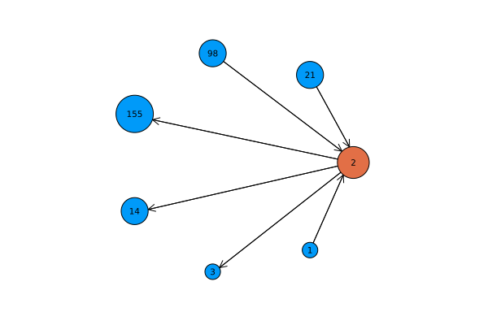
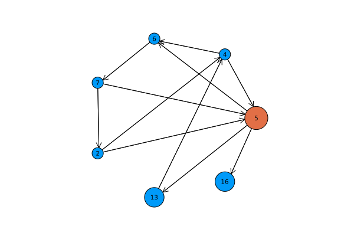

# Statistical modelling for the Assassins' Guild

### Creating the Graph

The graph must meet a few requirements:

- Every player targets three assassins and is targeted by three assassins
- A player cannot target themselves
- The graph cannot be easily reverse-engineered


### Modelling Assassin Activity

Some assassins may successfully execute dozens of targets, but many assassins fail to kill anyone at all.
This empirically follows some sort of [80/20 rule](https://en.wikipedia.org/wiki/Pareto_principle), where the top assassins conduct majority of assassinations.
Hence, we can use a [Pareto Distribution](https://en.wikipedia.org/wiki/Pareto_distribution) to model this behaviour.

### Retargeting Assassins

When an assassin dies, we must modify 7 nodes:

- one node for the dead assassin
- three nodes that attack the assassin
- three nodes that assassin used to attack

To illustrate this, we can plot a subset of the original graph:



When a particular node is removed:
- Three assassins are missing a target 
- Three targets are missing an assassin.

This is the simplest case, and there are a total of six possible solutions:

```
Solution #1:        Solution #2:        Solution #3:
    1 -> 3              1 -> 14             1 -> 155
   21 -> 14            21 -> 3             21 -> 3  
   98 -> 155           98 -> 155           98 -> 14 
            
Solution #4:        Solution #5:        Solution #6:
    1 -> 3              1 -> 14             1 -> 155
   21 -> 155           21 -> 155           21 -> 14 
   98 -> 14            98 -> 3             98 -> 3  
```

Analysis becomes more difficult when there are pre-existing relationships between nodes.
Consider a more complicated problem:




We model this particular problem with a matrix, which is successively simplified down:

```
Problem:

    6  13 16  
  ----------
2 | 1  1  1
4 | 0  0  1
7 | 0  1  1

Assassin 4 targets 16.

    6  13 16  
  ----------
2 | 1  1  0
4 | 0  0  0
7 | 0  1  0

Assassin 7 targets 13.

    6  13 16  
  ----------
2 | 1  0  0
4 | 0  0  0
7 | 0  0  0

Assassin 2 targets 6.
```

The corresponding object returned code would be:

```
RetargetingState(
    bitmat          = 0×0 BitMatrix, 
    attack_indexes  = Int64[], 
    target_indexes  = Int64[], 
    attack_counts   = UInt8[], 
    target_counts   = UInt8[],
    pairs           = [(4, 16), (7, 13), (2, 6)]
)
```

There is only one solution to this problem. If we added more constraints, the problem could be unsolveable.

